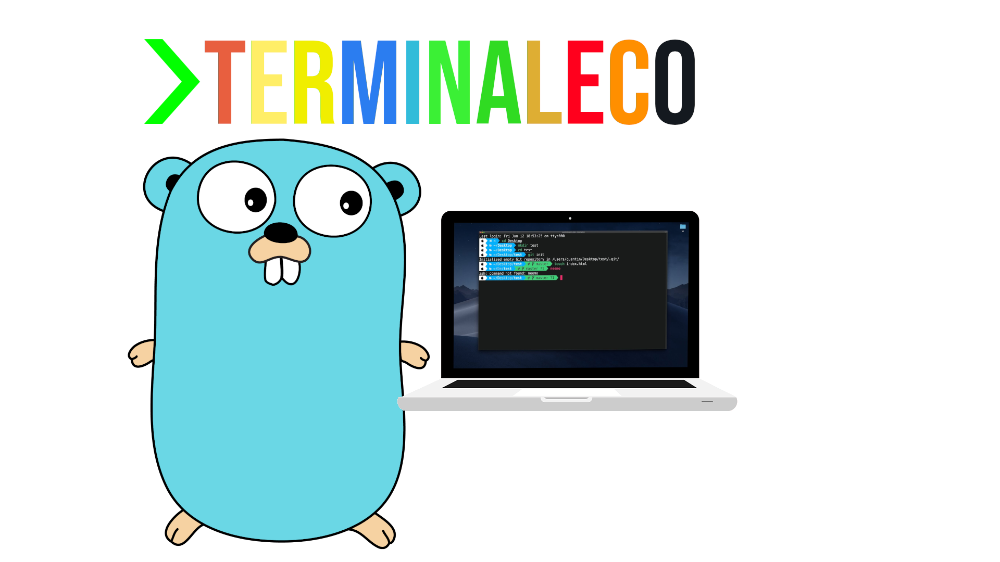

# Terminaleco

Terminaleco is a simple terminal written in Golang, using VTE and GTK.



# Install

## With Golang

If you have [Golang](https://golang.org/) installed in your machine, you can run:

```
go install github.com/edersonferreira/terminaleco
```

## AUR

If you are in a Arch based system, you can install with the AUR package `terminaleco-edersonferreira-git`, like:

```
yay -S terminaleco-edersonferreira-git
```

## Manually

You can clone and build manually, with the script:

```
cd /tmp
git clone https://github.com/edersonferreira/terminaleco
cd terminaleco
sudo mv bin/terminaleco /usr/bin/
```

# Why

This project is a simple and fast Golang terminal. You can use this project to pratice your Golang knowleadge, making new features and functions to it.
